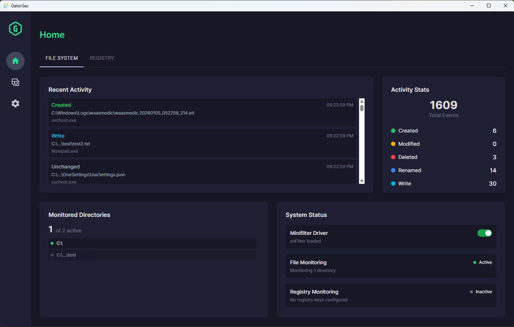
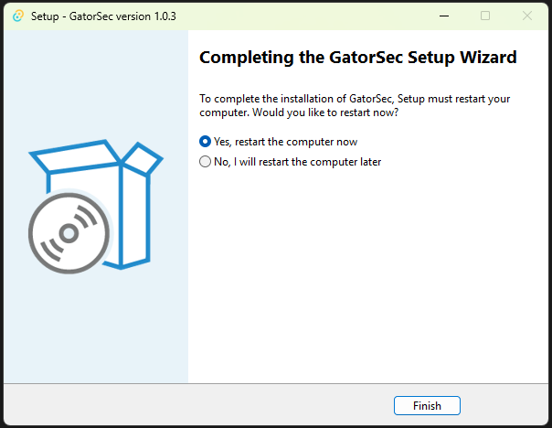

# GatorSec: File Integrity Monitoring

## Cybersecurity Windows Desktop App to Monitor Real-Time File Changes

A file integrity monitoring solution combining kernel-level instrumentation with an intuitive desktop interface. Leverages a Windows minifilter driver ([fsfilter-rs](https://github.com/SubconsciousCompute/fsfilter-rs)) to intercept file system operations at the kernel level, while the Rust backend processes events, applies filtering rules, and manages monitoring policies. Enables detection of malicious file modifications, ransomware activity, and unauthorized access patterns.

**Architecture:**
- **Kernel Driver (snFilter.sys)**: Windows minifilter that hooks into the file system to capture I/O operations
- **Rust Backend**: (`src-tauri/`) Communicates with the driver via Windows Filter Manager API, processes events, applies configurable filtering rules, manages persistent settings
- **Tauri-React Frontend**: (`src/`) Desktop UI built with Tauri for real-time event visualization, directory management, process forensics, and session logging

## Installation

1. Download the installer from [Releases](https://github.com/GeoffreyFClark/GatorSec/releases)
2. Run `GatorSec_Setup_x.x.x.exe` as Administrator
3. Follow the installation wizard
4. **Restart your computer** when prompted (required for driver installation)
5. After reboot, the driver installs automatically
6. Launch GatorSec from the desktop shortcut or Start Menu 




# Manually Building from Source

## Prerequisites
- [Rust](https://rustup.rs/) (with MSVC toolchain for Windows)
- [Node.js](https://nodejs.org/) (v16 or later)
- [Visual Studio Build Tools](https://visualstudio.microsoft.com/downloads/) with "Desktop development with C++"

**Note:** The minifilter driver (`snFilter.sys`) is a kernel-mode Windows driver that can intercept file system operations. It is pre-compiled from [fsfilter-rs](https://github.com/SubconsciousCompute/fsfilter-rs) and included as a binary in `src-tauri/drivers/`. You do not need the Windows Driver Kit (WDK) to build this project.

## Manual Build Steps

1. Clone the repository:
```bash
git clone https://github.com/GeoffreyFClark/GatorSec
cd GatorSec
```

2. Install dependencies:
```bash
npm install
```

3. Build the application:
```bash
npm run tauri build -- --bundles none
```

This creates `GatorSec.exe` at `src-tauri/target/release/GatorSec.exe`

### Building the Installer (Optional)

After building GatorSec.exe, to create a distributable installer that handles minifilter driver installation automatically:

1. Install [Inno Setup 6](https://jrsoftware.org/isdl.php)
2. Build the installer:
```powershell
& "C:\Program Files (x86)\Inno Setup 6\ISCC.exe" installer\gatorsec.iss
```

This creates `dist/GatorSec_Setup_x.x.x.exe` which automates the driver installation.



### Driver Installation (Manual Setup)

The minifilter driver must be installed separately. This is a one-time process that requires a system reboot.

**Important:** Keep the repository in a stable location, as the driver installation references files in `src-tauri/drivers/`.

**Step 1: Enable test signing (Administrator PowerShell)**
```powershell
bcdedit -set TESTSIGNING ON
Restart-Computer
```

**Step 2: After reboot, install the driver (Administrator PowerShell)**
```powershell
cd src-tauri\drivers

# Install self-signed certificate
certutil -addstore -enterprise "Root" "snFilter.cer"

# Install driver
pnputil -i -a "snFilter.inf"

# Load the minifilter driver
fltmc load snFilter

# Verify driver is running
fltmc filters | findstr snFilter
```

If `fltmc` shows `snFilter` in the output, the driver is successfully installed.

**Step 3: Run the application**
```powershell
src-tauri\target\release\GatorSec.exe
```

### Development Mode
```bash
npm run tauri dev
```

**Note:** File monitoring requires the driver to be installed first. The driver loads automatically when the application starts.
