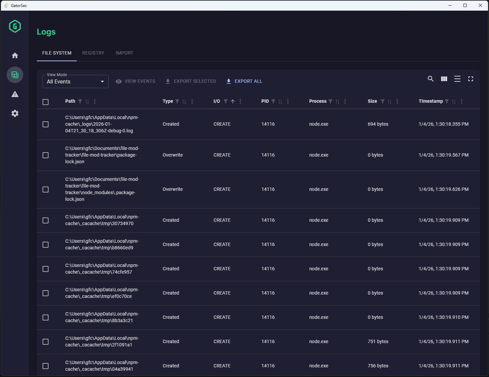
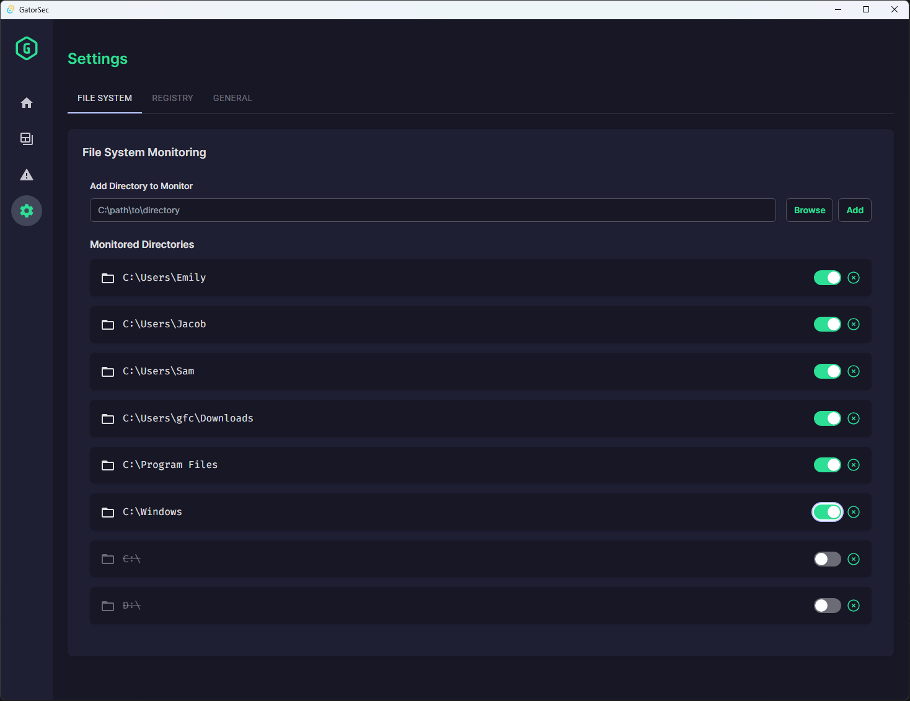
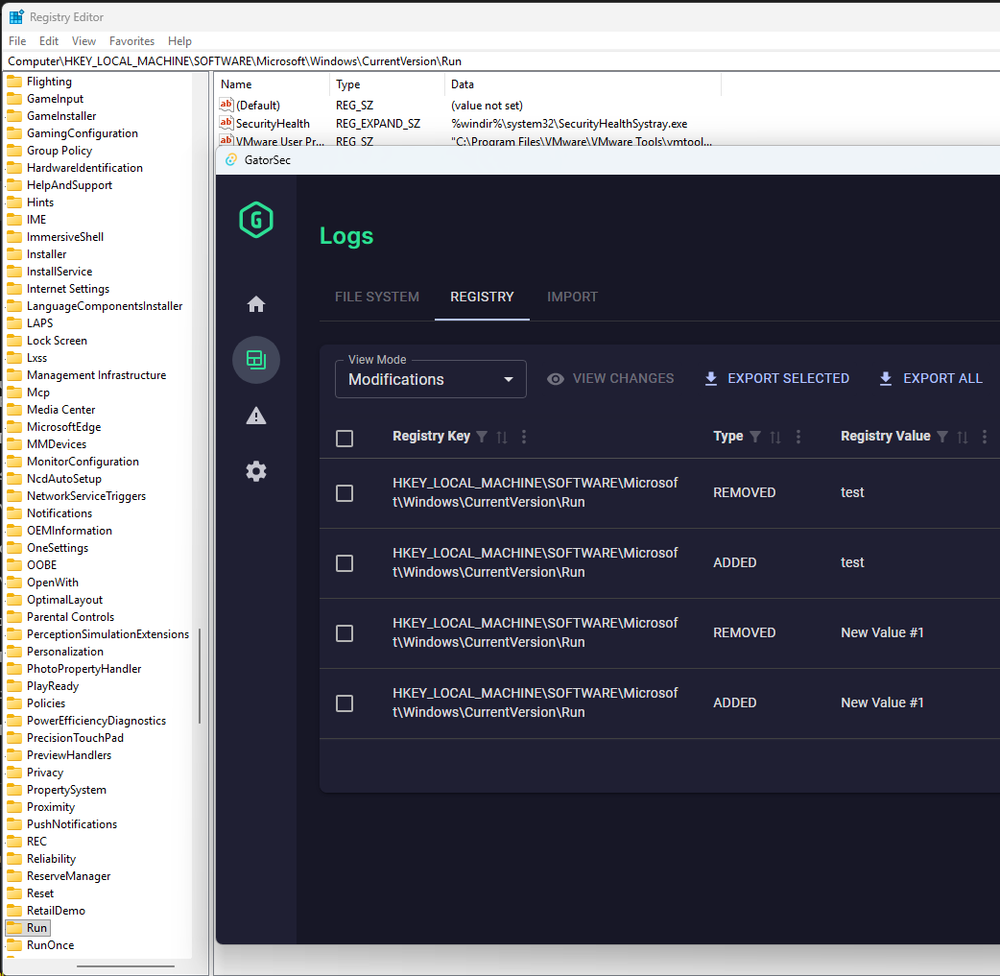
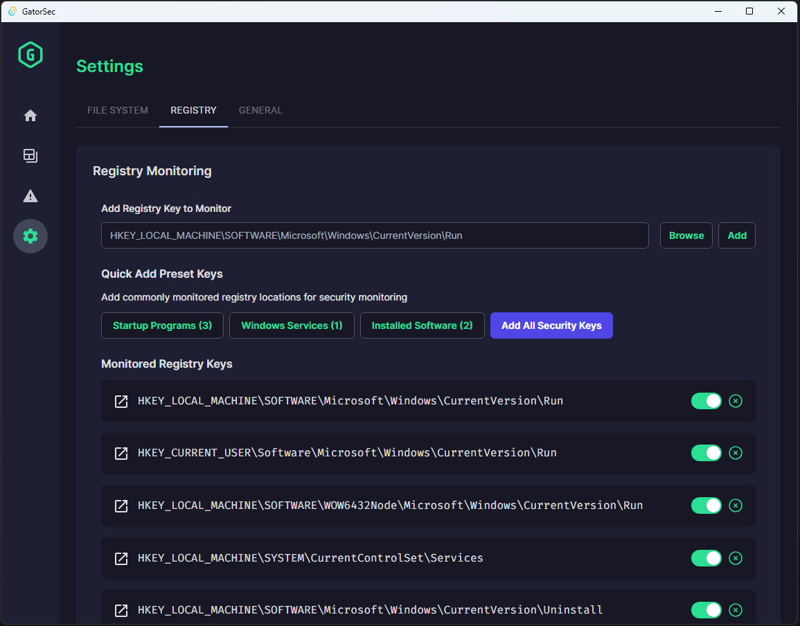
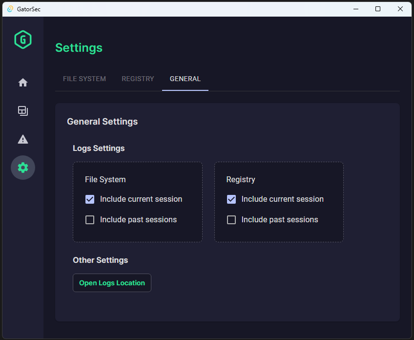

# GatorSec File Integrity Monitoring (CyberSec App)

## A Cybersecurity App for Monitoring Real-Time File Changes

A comprehensive file integrity monitoring solution combining kernel-level instrumentation with an intuitive desktop interface. The application leverages a Windows minifilter driver ([fsfilter-rs](https://github.com/SubconsciousCompute/fsfilter-rs)) to intercept file system operations at the kernel level, while the Rust backend processes events, applies intelligent filtering, and manages monitoring policies. This architecture enables zero-overhead detection of malicious file modifications, ransomware activity, and unauthorized access patterns across the system.

**Architecture:**
- **Kernel Driver (snFilter.sys)**: Windows minifilter that hooks into the file system to capture I/O operations
- **Rust Backend**: Communicates with the driver via Windows Filter Manager API, processes events, applies configurable filtering rules, manages persistent settings
- **React Frontend**: Desktop UI built with Tauri for real-time event visualization, directory management, process forensics, and session logging

## Installation

1. Download the installer from [Releases](https://github.com/GeoffreyFClark/file-mod-tracker/releases)
2. Run `GatorSec_Setup_x.x.x.exe` as Administrator
3. Follow the installation wizard
4. **Restart your computer** when prompted (required for driver installation)
5. After reboot, the driver installs automatically
6. Launch GatorSec from the desktop shortcut or Start Menu 







## User Guide

### Dashboard (Home)
The dashboard provides an at-a-glance overview with separate tabs for File System and Registry monitoring:
- **Recent Activity Feed**: Scrollable list of recent events with color-coded actions
- **Activity Stats**: Event counts by type (Created/Modified/Deleted/Renamed or Added/Updated/Removed)
- **Monitored Paths**: Summary of configured directories or registry keys with status indicators
- **System Status**: Real-time status for minifilter driver, file monitoring, and registry monitoring
  - **Minifilter Driver**: Shows loaded/unloaded status with toggle switch to control the driver
  - The driver automatically loads when GatorSec starts and can be manually toggled off if needed

### Adding Directories to Monitor
1. Navigate to **Settings** tab
2. Click **Add Directory**
3. Select folder to monitor
4. Directory appears in monitored list and tracking begins immediately

Alternatively, click the **Add** icon next to any file path in the Logs view to monitor its parent directory.

### Managing Monitored Directories
- **Enable/Disable**: Toggle monitoring without removing the directory
- **Remove**: Click trash icon to stop monitoring and remove from list
- Settings persist between sessions

### Viewing File Changes (Logs)
The Logs page table displays:
- **Path**: Full file path (click to copy, open location, or add to monitoring)
- **Status**: Created, Modified, Deleted, or Renamed
- **Timestamp**: When the change occurred
- **Process**: Which process made the change (click to open location, view properties, or terminate)
- **Process Path**: Full path to the executable

### Working with Processes
Process actions include:
- **Open Location**: Navigate to process executable in File Explorer
- **View Properties**: Windows properties dialog for the executable
- **Terminate**: Kill the process (requires confirmation)

### Registry Monitoring
The application monitors registry keys for security-relevant changes:
- **Value Changes**: Detects when registry values are added, modified, or deleted
- **Subkey Changes**: Detects when new subkeys are created or removed under monitored keys
- **Key Path**: Full registry path (click to copy or open in Registry Editor)
- **Operation Types**: ADDED, UPDATED, REMOVED, SUBKEY_ADDED, SUBKEY_REMOVED
- **Timestamp**: When the change occurred

**Note:** Registry monitoring tracks direct value changes and immediate subkeys of monitored keys. It does not recursively monitor all nested subkeys for performance reasons.

### Session Logs
File and registry changes are logged to:
- Location: `%APPDATA%\com.gatorsec.dev\logs\`
- Format: `file_session_YYYY-MM-DD_HH-MM-SS.log` and `registry_session_YYYY-MM-DD_HH-MM-SS.log`
- Content: JSON array of all changes during the session
- Logs are cleared on app restart (session-based design)

## Troubleshooting

### Driver Not Loading
Check driver status: `fltmc filters | findstr snFilter`

If not listed:
- Verify test signing is enabled and reboot was completed after driver installation
- The driver loads automatically when GatorSec starts - try launching the application
- Use the toggle switch in the Dashboard's System Status panel to manually load the driver

### No File Events Appearing
- Verify directory is enabled in Settings
- Check if process is in exclusion list (SearchProtocolHost.exe, SearchIndexer.exe are excluded by default)
- Ensure you have read permissions for the monitored directory

## Manually Building from Source

### Prerequisites
- [Rust](https://rustup.rs/) (with MSVC toolchain for Windows)
- [Node.js](https://nodejs.org/) (v16 or later)
- [Visual Studio Build Tools](https://visualstudio.microsoft.com/downloads/) with "Desktop development with C++"

**Note:** The minifilter driver (`snFilter.sys`) is a kernel-mode Windows driver that can intercept file system operations. It is pre-compiled from [fsfilter-rs](https://github.com/SubconsciousCompute/fsfilter-rs) and included as a binary in `src-tauri/drivers/`. You do not need the Windows Driver Kit (WDK) to build this project.

### Manual Build Steps

1. Clone the repository:
```bash
git clone https://github.com/GeoffreyFClark/file-mod-tracker
cd file-mod-tracker
```

2. Install dependencies:
```bash
npm install
```

3. Build the application:
```bash
npm run tauri build -- --bundles none
```

This creates `GatorSec.exe` at `src-tauri/target/release/GatorSec.exe`

### Building the Installer (Optional)

After building GatorSec.exe, to create a distributable installer that handles minifilter driver installation automatically:

1. Install [Inno Setup 6](https://jrsoftware.org/isdl.php)
2. Build the installer:
```powershell
& "C:\Program Files (x86)\Inno Setup 6\ISCC.exe" installer\gatorsec.iss
```

This creates `dist/GatorSec_Setup_x.x.x.exe`

### Driver Installation (Manual Setup)

The minifilter driver must be installed separately. This is a one-time process that requires a system reboot.

**Important:** Keep the repository in a stable location, as the driver installation references files in `src-tauri/drivers/`.

**Step 1: Enable test signing (Administrator PowerShell)**
```powershell
bcdedit -set TESTSIGNING ON
Restart-Computer
```

**Step 2: After reboot, install the driver (Administrator PowerShell)**
```powershell
cd src-tauri\drivers

# Install self-signed certificate
certutil -addstore -enterprise "Root" "snFilter.cer"

# Install driver
pnputil -i -a "snFilter.inf"

# Load the minifilter driver
fltmc load snFilter

# Verify driver is running
fltmc filters | findstr snFilter
```

If `fltmc` shows `snFilter` in the output, the driver is successfully installed.

**Step 3: Run the application**
```powershell
src-tauri\target\release\GatorSec.exe
```

### Development Mode
```bash
npm run tauri dev
```

**Note:** Development mode will launch the app, but file monitoring will not work until the driver is installed using the steps above. The driver automatically loads when the application starts. You can also manually load it with `fltmc load snFilter` or use the toggle in the Dashboard.

### Architecture Notes

- **Application Code**: Rust backend (`src-tauri/`) + React TypeScript frontend (`src/`)
- **Minifilter Driver**: Pre-compiled binary from [fsfilter-rs](https://github.com/SubconsciousCompute/fsfilter-rs)
- **Driver Lifecycle**: The driver is installed once (requires reboot), then loads/unloads on demand when GatorSec runs
- **Communication**: Application connects to driver via `FilterConnectCommunicationPort` API
- **Build Output**: Portable `.exe` or Inno Setup installer (in `installer/`)
